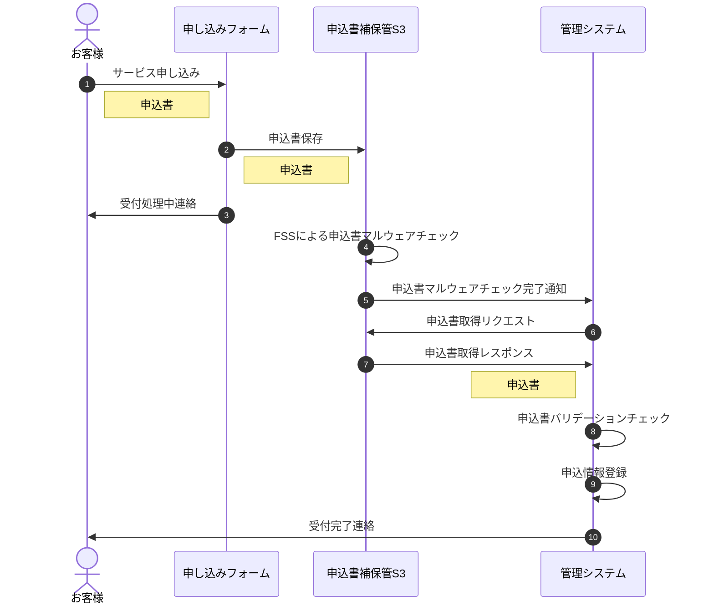

# Mikke-Server
> [!WARNING]
> Authentication feature is not yet available.

[//]: # (> [!CAUTION])

[//]: # (> 実運用する際は鍵を新たに生成して、秘密鍵は絶対に公開しないでください。)
## Start the server
Create a Docker image
```zsh
$ make build-local
```
Use Docker Compose to start each service.
```zsh
$ make up
```
Perform a migration to MySQL.
```zsh
$ make migrate
```

## Endpoint

[//]: # (- `/login`)

[//]: # (<details>)

[//]: # (<summary>input</summary>)

[//]: # ()
[//]: # (```json)

[//]: # ({)

[//]: # (  "title": "ここにタイトルが入る",)

[//]: # (  "comment": "ここにコメントが入る")

[//]: # (})

[//]: # (```)

[//]: # (</details>)

### **POST** `/post`
- 投稿する
<details>
<summary>input</summary>

```json
{
  "title": "ここにタイトルが入る",
  "comment": "ここにコメントが入る"
}
```
</details>

### **GET** `/lists`
- すべての投稿を取得する
<details>
<summary>output</summary>

```json
[
  {
    "post_id": 3,
    "title": "介護アプリの開発",
    "created": "2024-04-27T06:49:01.803146Z"
  },
  {
    "post_id": 2,
    "title": "サンプルタイトル",
    "created": "2024-04-27T06:11:18.298827Z"
  }
]
```
</details>

### **GET** `/post/{post_id}`
- クエリパラメータではない
<details>
<summary>output</summary>
例えば /post/4 をGETで叩くと以下が得られる

```json
{
  "post_id": 4,
  "user_ID": 7777,
  "title": "学習アプリの開発",
  "comment": "Swiftで書きたい",
  "created": "2024-04-27T12:59:07.379881Z",
  "modified": "2024-04-27T12:59:07.379881Z"
}
```
</details>

### **POST** `/reply`
<details>
<summary>input</summary>

```json
{
  "post_id": 4,
  "title": "直接APIを叩かせよう！！",
  "comment": "UXなんて知らん！GUI作りたいなら自分で作れ！！笑"
}
```
</details>

### **GET** `/reply/list/{post_id}`
- クエリパラメータではない
<details>
<summary>output</summary>
例えば /reply/list/4 をGETで叩くと以下が得られる.
古い順にソートされて出力される

```json
[
  {
    "reply_id": 1,
    "post_id": 4,
    "user_id": 7777,
    "title": "swift使ったことない",
    "comment": "別の言語じゃだめですか？？",
    "created": "2024-04-28T10:54:35Z",
    "modified": "2024-04-28T10:54:36Z"
  },
  {
    "reply_id": 2,
    "post_id": 4,
    "user_id": 7777,
    "title": "自分もない！！",
    "comment": "何かいい言語ありますかー？？",
    "created": "2024-04-28T10:55:20Z",
    "modified": "2024-04-28T10:55:22Z"
  }
]
```
</details>

